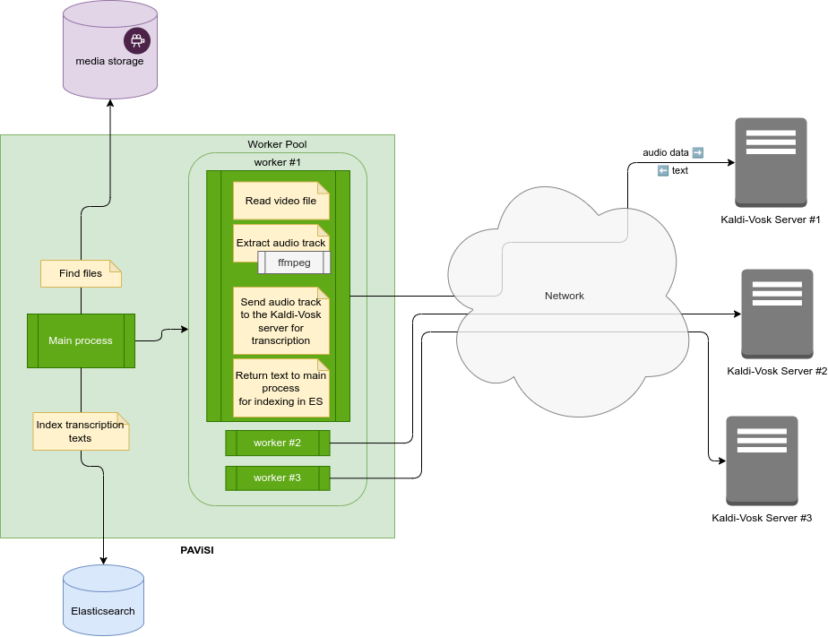

PAViSI: PHP Advanced Video STT Indexer
======================================

## About the project

Over the years I've been accumulating a _lot_ of documentaries on various topics. But now it's extremly difficult to
remember where I saw this or that, heard about _this_ technology or discovered _this_ location.

So I thougt: "Hey, why now transcribe all the spoken parts and store them in a local search engine so that I could
query for terms and such, and therefore maybe find videos easier?"

Then I found [Vosk](https://alphacephei.com/vosk/server), a server that is able to recognize speech from an audio
stream and return text through a simple WebSocket. It was working okay, but it was extremely slow and I had dozens
of videos to process. I needed to use multiple servers in parallel to speed up the whole process, giving each one
a single file at a time.

There was no tool for such a job, or at least I could not find one that would fit my needs.

## Requisites

- PHP 8.2+
- [Enough running Kaldi-Vosk servers](https://alphacephei.com/vosk/server)

## Limitations

- All your videos need to use the same language. You cannot have one Kaldi-Vosk server running an English
  model while another one is running Spanish.

## Usage

```shell
$ bin/console app:run -h
Description:
  Run!

Usage:
  app:run [options] [--] <folder>...

Arguments:
  folder                   The target folder(s) containing the files to index.

Options:
  -E, --exclude=EXCLUDE    Excluded path(s) (multiple values allowed)
  -I, --include=INCLUDE    Included path(s) (multiple values allowed)
  -N, --dry-run[=DRY-RUN]  Dry-run (0: disabled, 1: success, 2: failure) [default: 0]
  -p, --progress=PROGRESS  Show progress (0: disabled, 1: simple, 2: two-pass) Notice: needs to count files first. [default: 0]
  -h, --help               Display help for the given command. When no command is given display help for the list command
```

## How does it work?

Basically:

- **Prerequisite:** Start enough [Kaldi-Vosk servers](https://alphacephei.com/vosk/server) for you needs, then edit the
  `app.vosk.instances` section in your [`config.yaml`](./config/app/config.yaml) accordingly.

- Run the CLI command `bin/console app:run <folder>`
- The main process browses the media storage (your `<folder>` above) to find videos
- If they are not already indexed, it gives each one to the Worker Pool
- The Worker Pool has a worker for every remote Kaldi-Vosk server previously configured
- Within the WP, an available worker picks a video, extract the audio track into the right format for Kaldi-Vosk, 
  then send it to the server over WebSocket for transcrption. The server then returns the transcripted text.
- At the end of a file, the worker returns the transcripted text to the main process that will index it to
  ElasticSearch with some metadata.



## Known issues

### mapper_parsing_exception: The number of nested documents has exceeded the allowed limit of [...].

```
mapper_parsing_exception: The number of nested documents has exceeded the allowed limit of [10000].
This limit can be set by changing the [index.mapping.nested_objects.limit] index level setting.
```

This can easily happen with large files or with a lot of spoken parts.  
Adjust your Elasticsearch config accordingly:

```shell
curl -X PUT 'http://${elasticsearch_host}:9200/${index}/_settings?preserve_existing=true' -d '{
  "index.mapping.nested_objects.limit" : "100000"
}'
```
